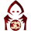

# Demon

##  [Caetrum](Caetrum)
When a potion breaks, another one might break as well. Each night*, choose a player; they die. [-0 or -1 Outsider]

##  [Commira](Commira)
Each night choose, 3 different players; they each receive a Potion. Each night* choose a player; they die.

##  [God Seeker](God%20Seeker)
You have an off-script Demon ability. Once per game, a good player learns what Demon that is.

##  [Griffin](Griffin)
Each night* choose a player, they die. Once per game choose an additional player they might die at any time.

##  [Hydra](Hydra)
Each night* choose a player; if picked by both Hydra they die, or else poisoned until dusk. Each day, a 2nd execution starts after the 1st. Then, if a Hydra was executed an alive player becomes an evil Hydra. You know all Hydra. Execution fails, if only Hydra voted. [+1 Hydra; No minions]

##  [Infectious Hive](Infectious%20Hive)
Each night* choose a player their vote gets inverted if at least 2 players votes are inverted that way they die. All evil acts together except first night

##  [Lemures](Lemures)
Each night* choose a player; they die. The first time a Lemures gets executed by vote, the nominator becomes an Evil Lemures. [If 5 or more players are alive]

##  [Mal](Mal)
Each night choose if you want to change from human form to dragon or from dragon form to human or not. If you switch your form you can't do anything else that night, if you stay in the human form choose 2 players, 1 is mad that the 2nd is a minion. If the 1st player breaks the madness he or both might be executed. When you are in the dragon form choose a player they are poisoned, the previously poisoned player dies.

##  [Megalomaniac](Megalomaniac)
Each night*, choose a player; they die. On your first night 3 players receive a Potion of Terror.

##  [Polterghast](Polterghast)
Each night*, choose a player: they die. Their good neighbors' abilities yield false info until you act again.

##  [Revenant](Revenant)
Each night* choose a player; they die. Players that spoke about your role might die the following night.

##  [Trial Master](Trial%20Master)
Each night*, choose 2 players: one dies and the other must go to the storyteller to learn a mission and complete it or die.

##  [Troupe Master](Troupe%20Master)
Each night*, choose a player: they die. You know ? in-play characters. All players learn if you chose all & evil wins at dusk.

##  [Wraith](Wraith)
Each night* you may choose a player; they die. While your last choice is no-one, a player is poisoned, and you choose 2 instead.

