# HomeBrew

## Townsfolk
- 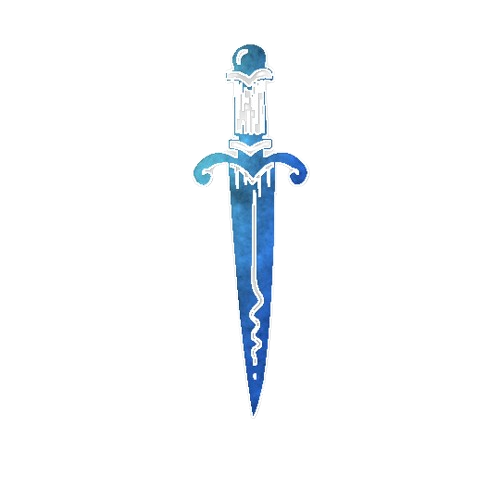 <a href="https://github.com/yoyosource/BOTC-HomeBrew/tree/master/Townsfolk/Anthropomancer">Anthropomancer</a>
- 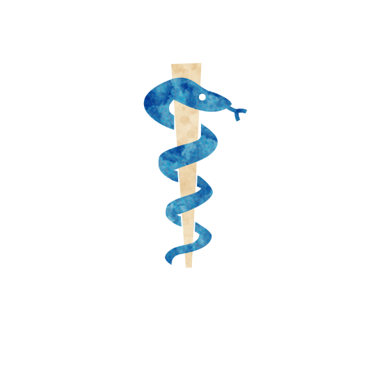 <a href="https://github.com/yoyosource/BOTC-HomeBrew/tree/master/Townsfolk/Apothecary">Apothecary</a>
- 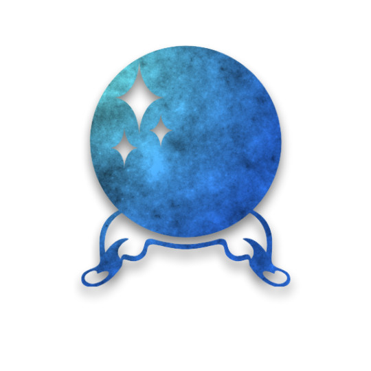 <a href="https://github.com/yoyosource/BOTC-HomeBrew/tree/master/Townsfolk/Auric">Auric</a>
- <a href="https://github.com/yoyosource/BOTC-HomeBrew/tree/master/Townsfolk/Balloonist-OLD">Balloonist-OLD</a>
-  <a href="https://github.com/yoyosource/BOTC-HomeBrew/tree/master/Townsfolk/Baptist">Baptist</a>
-  <a href="https://github.com/yoyosource/BOTC-HomeBrew/tree/master/Townsfolk/Confessor">Confessor</a>
- 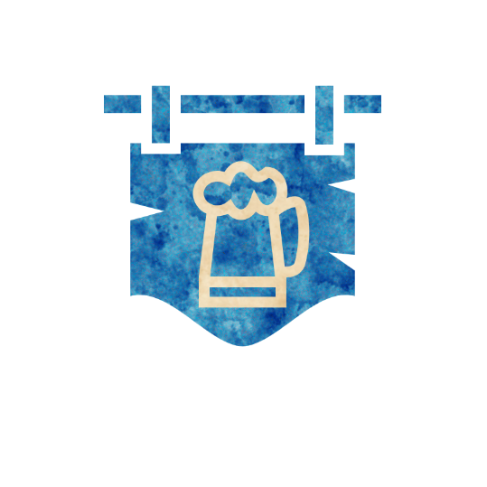 <a href="https://github.com/yoyosource/BOTC-HomeBrew/tree/master/Townsfolk/Distiller">Distiller</a>
- <a href="https://github.com/yoyosource/BOTC-HomeBrew/tree/master/Townsfolk/Enumerator">Enumerator</a>
-  <a href="https://github.com/yoyosource/BOTC-HomeBrew/tree/master/Townsfolk/Eternal%20Singer">Eternal Singer</a>
- <a href="https://github.com/yoyosource/BOTC-HomeBrew/tree/master/Townsfolk/Huntsman-FIX">Huntsman-FIX</a>
- 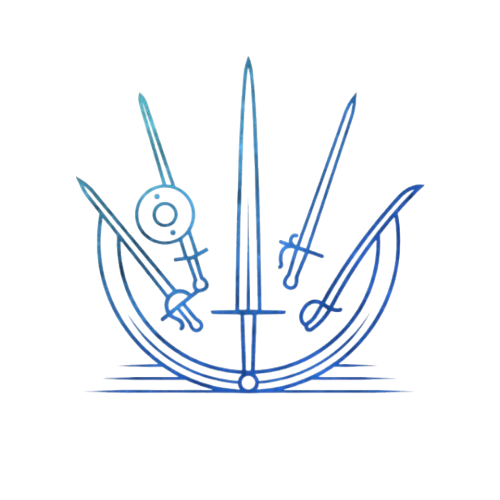 <a href="https://github.com/yoyosource/BOTC-HomeBrew/tree/master/Townsfolk/Master-at-Arms">Master-at-Arms</a>
- 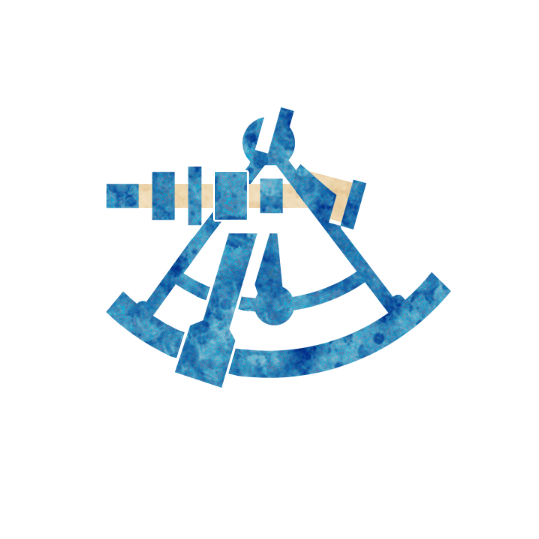 <a href="https://github.com/yoyosource/BOTC-HomeBrew/tree/master/Townsfolk/Merchant">Merchant</a>
- 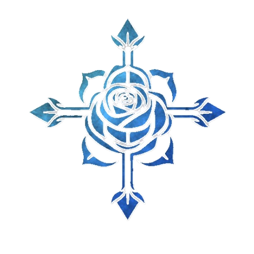 <a href="https://github.com/yoyosource/BOTC-HomeBrew/tree/master/Townsfolk/Mourner">Mourner</a>
-  <a href="https://github.com/yoyosource/BOTC-HomeBrew/tree/master/Townsfolk/Night%20Guardian">Night Guardian</a>
- 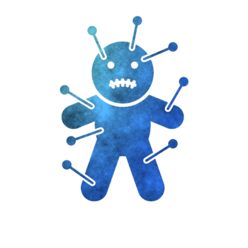 <a href="https://github.com/yoyosource/BOTC-HomeBrew/tree/master/Townsfolk/Obatala">Obatala</a>
-  <a href="https://github.com/yoyosource/BOTC-HomeBrew/tree/master/Townsfolk/Pale%20Knight">Pale Knight</a>
-  <a href="https://github.com/yoyosource/BOTC-HomeBrew/tree/master/Townsfolk/Philanthropist">Philanthropist</a>
-  <a href="https://github.com/yoyosource/BOTC-HomeBrew/tree/master/Townsfolk/Proud%20Warrior">Proud Warrior</a>
-  <a href="https://github.com/yoyosource/BOTC-HomeBrew/tree/master/Townsfolk/Shopkeeper">Shopkeeper</a>
-  <a href="https://github.com/yoyosource/BOTC-HomeBrew/tree/master/Townsfolk/Spirited%20Youth">Spirited Youth</a>
-  <a href="https://github.com/yoyosource/BOTC-HomeBrew/tree/master/Townsfolk/Sworn%20Protector">Sworn Protector</a>
-  <a href="https://github.com/yoyosource/BOTC-HomeBrew/tree/master/Townsfolk/Toll%20Inspector">Toll Inspector</a>
- 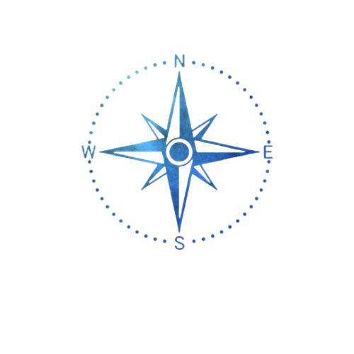 <a href="https://github.com/yoyosource/BOTC-HomeBrew/tree/master/Townsfolk/Wanderer">Wanderer</a>
- 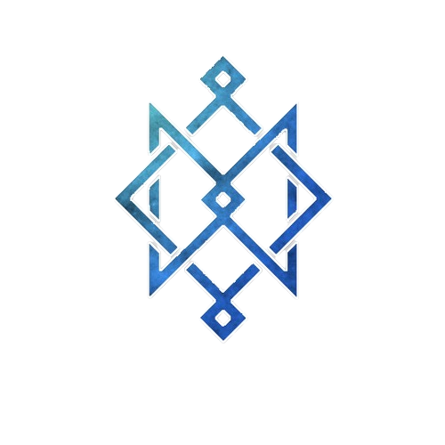 <a href="https://github.com/yoyosource/BOTC-HomeBrew/tree/master/Townsfolk/Weaver">Weaver</a>

## Outsider
- 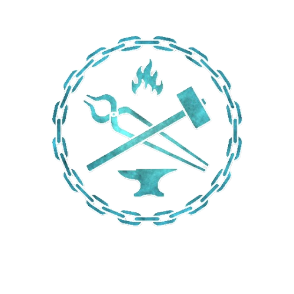 <a href="https://github.com/yoyosource/BOTC-HomeBrew/tree/master/Outsider/Blacksmith">Blacksmith</a>
-  <a href="https://github.com/yoyosource/BOTC-HomeBrew/tree/master/Outsider/Butterfingers">Butterfingers</a>
- 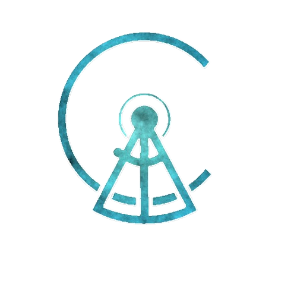 <a href="https://github.com/yoyosource/BOTC-HomeBrew/tree/master/Outsider/Cartographer">Cartographer</a>
-  <a href="https://github.com/yoyosource/BOTC-HomeBrew/tree/master/Outsider/Demonic%20Traits">Demonic Traits</a>
- 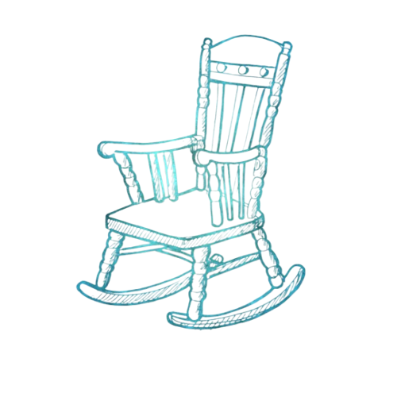 <a href="https://github.com/yoyosource/BOTC-HomeBrew/tree/master/Outsider/Grump">Grump</a>
- 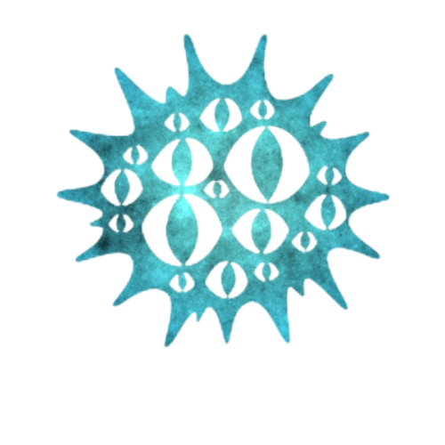 <a href="https://github.com/yoyosource/BOTC-HomeBrew/tree/master/Outsider/Maniac">Maniac</a>
-  <a href="https://github.com/yoyosource/BOTC-HomeBrew/tree/master/Outsider/Pale%20Lord">Pale Lord</a>
- 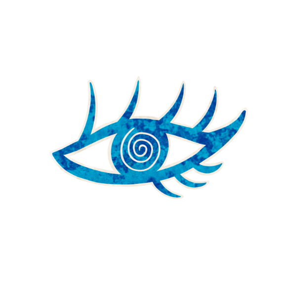 <a href="https://github.com/yoyosource/BOTC-HomeBrew/tree/master/Outsider/Siren">Siren</a>
- 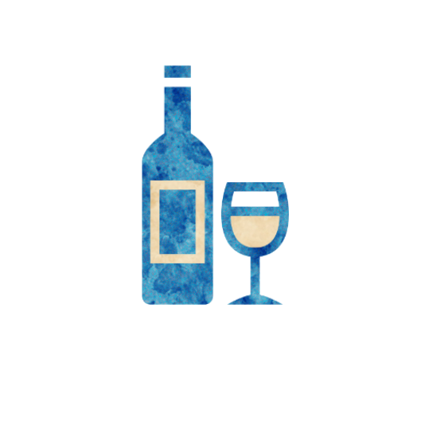 <a href="https://github.com/yoyosource/BOTC-HomeBrew/tree/master/Outsider/Sommelier">Sommelier</a>
-  <a href="https://github.com/yoyosource/BOTC-HomeBrew/tree/master/Outsider/Student">Student</a>
-  <a href="https://github.com/yoyosource/BOTC-HomeBrew/tree/master/Outsider/Weeping%20Angel">Weeping Angel</a>

## Minion
- 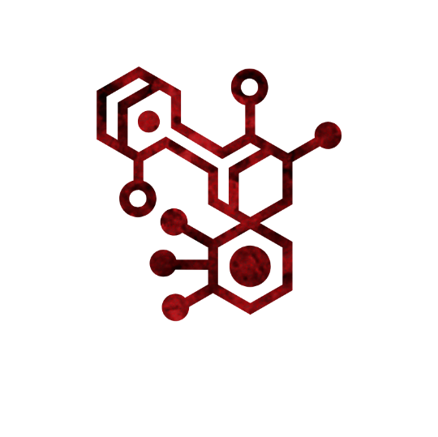 <a href="https://github.com/yoyosource/BOTC-HomeBrew/tree/master/Minion/Chemist">Chemist</a>
- 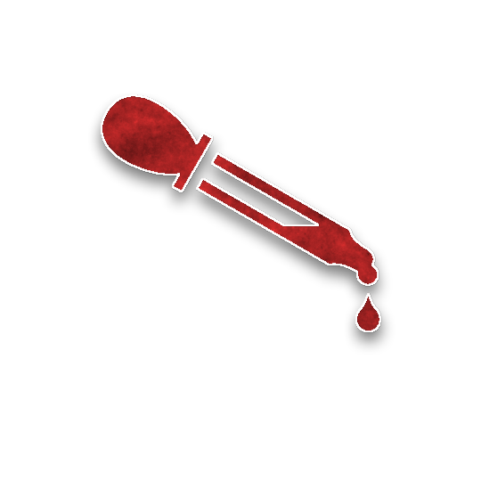 <a href="https://github.com/yoyosource/BOTC-HomeBrew/tree/master/Minion/Contaminator">Contaminator</a>
- 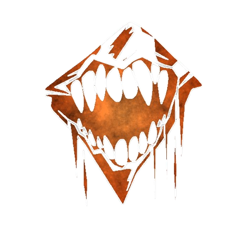 <a href="https://github.com/yoyosource/BOTC-HomeBrew/tree/master/Minion/Corrupted">Corrupted</a>
- 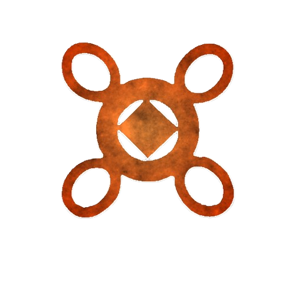 <a href="https://github.com/yoyosource/BOTC-HomeBrew/tree/master/Minion/Intwaso">Intwaso</a>
-  <a href="https://github.com/yoyosource/BOTC-HomeBrew/tree/master/Minion/Lurking%20Shadow">Lurking Shadow</a>
- 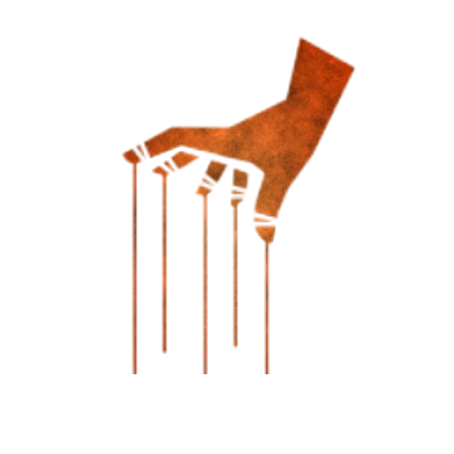 <a href="https://github.com/yoyosource/BOTC-HomeBrew/tree/master/Minion/Manipulator">Manipulator</a>
-  <a href="https://github.com/yoyosource/BOTC-HomeBrew/tree/master/Minion/Mask%20Maker">Mask Maker</a>
- 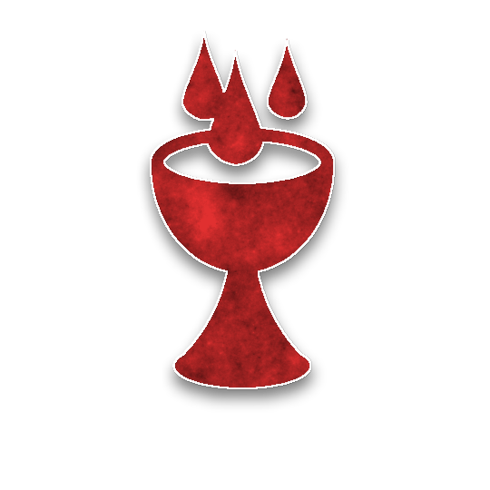 <a href="https://github.com/yoyosource/BOTC-HomeBrew/tree/master/Minion/Meddler">Meddler</a>
-  <a href="https://github.com/yoyosource/BOTC-HomeBrew/tree/master/Minion/Nostalgic%20Elder">Nostalgic Elder</a>
- 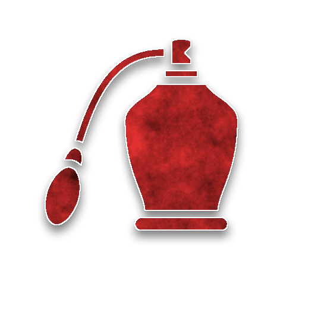 <a href="https://github.com/yoyosource/BOTC-HomeBrew/tree/master/Minion/Perfumer">Perfumer</a>
-  <a href="https://github.com/yoyosource/BOTC-HomeBrew/tree/master/Minion/Phantom%20Thief">Phantom Thief</a>
- <a href="https://github.com/yoyosource/BOTC-HomeBrew/tree/master/Minion/Psychopath-FIX">Psychopath-FIX</a>
- 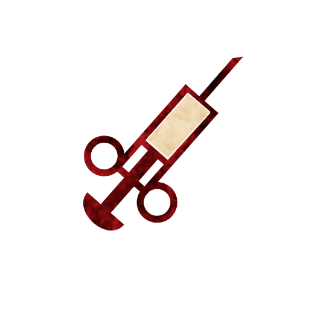 <a href="https://github.com/yoyosource/BOTC-HomeBrew/tree/master/Minion/Reanimator">Reanimator</a>
- 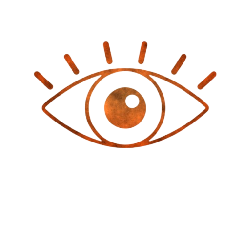 <a href="https://github.com/yoyosource/BOTC-HomeBrew/tree/master/Minion/Seer">Seer</a>
- 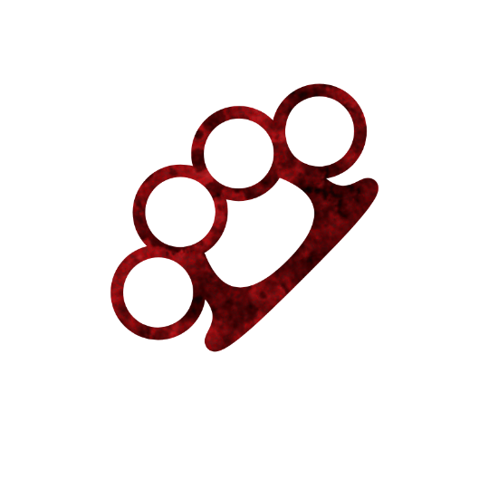 <a href="https://github.com/yoyosource/BOTC-HomeBrew/tree/master/Minion/Thug">Thug</a>

## Demon
- 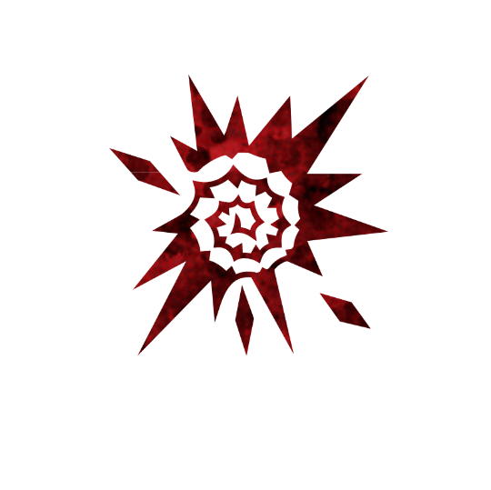 <a href="https://github.com/yoyosource/BOTC-HomeBrew/tree/master/Demon/Caetrum">Caetrum</a>
- 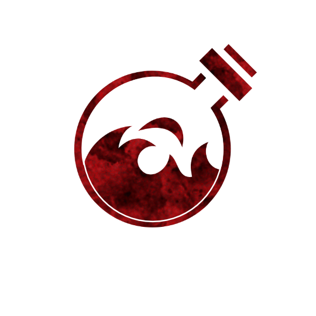 <a href="https://github.com/yoyosource/BOTC-HomeBrew/tree/master/Demon/Commira">Commira</a>
-  <a href="https://github.com/yoyosource/BOTC-HomeBrew/tree/master/Demon/God%20Seeker">God Seeker</a>
- <a href="https://github.com/yoyosource/BOTC-HomeBrew/tree/master/Demon/Griffin">Griffin</a>
- 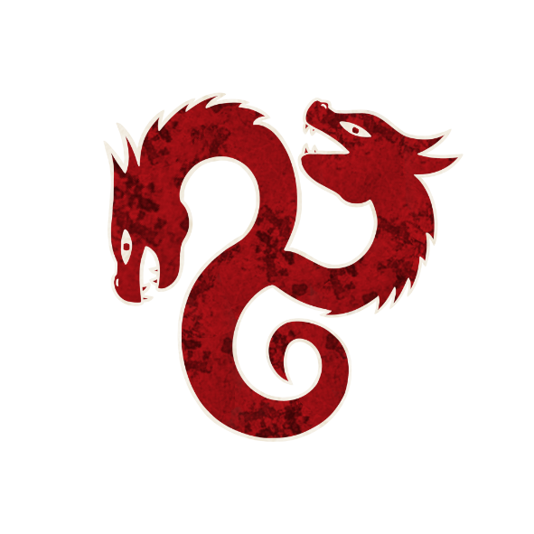 <a href="https://github.com/yoyosource/BOTC-HomeBrew/tree/master/Demon/Hydra">Hydra</a>
-  <a href="https://github.com/yoyosource/BOTC-HomeBrew/tree/master/Demon/Infectious%20Hive">Infectious Hive</a>
- 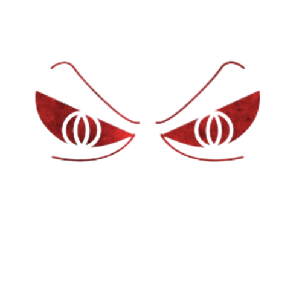 <a href="https://github.com/yoyosource/BOTC-HomeBrew/tree/master/Demon/Lemures">Lemures</a>
- <a href="https://github.com/yoyosource/BOTC-HomeBrew/tree/master/Demon/Mal">Mal</a>
-  <a href="https://github.com/yoyosource/BOTC-HomeBrew/tree/master/Demon/Megalomaniac">Megalomaniac</a>
- 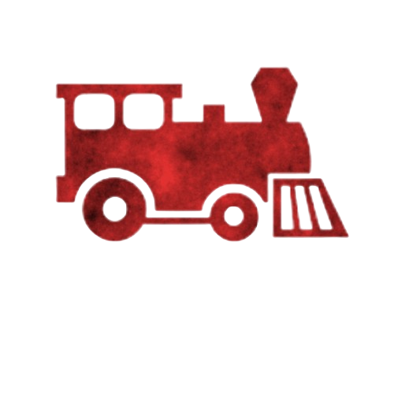 <a href="https://github.com/yoyosource/BOTC-HomeBrew/tree/master/Demon/Polterghast">Polterghast</a>
- 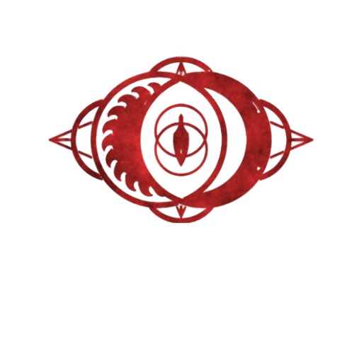 <a href="https://github.com/yoyosource/BOTC-HomeBrew/tree/master/Demon/Revenant">Revenant</a>
-  <a href="https://github.com/yoyosource/BOTC-HomeBrew/tree/master/Demon/Trial%20Master">Trial Master</a>
-  <a href="https://github.com/yoyosource/BOTC-HomeBrew/tree/master/Demon/Troupe%20Master">Troupe Master</a>
- 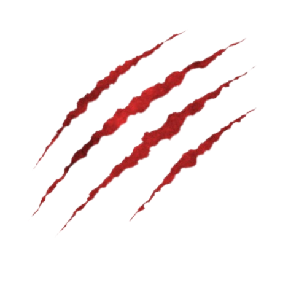 <a href="https://github.com/yoyosource/BOTC-HomeBrew/tree/master/Demon/Wraith">Wraith</a>

## Fabled
-  <a href="https://github.com/yoyosource/BOTC-HomeBrew/tree/master/Fabled/Doppelgänger">Doppelgänger</a>
-  <a href="https://github.com/yoyosource/BOTC-HomeBrew/tree/master/Fabled/Glassblower">Glassblower</a>
- 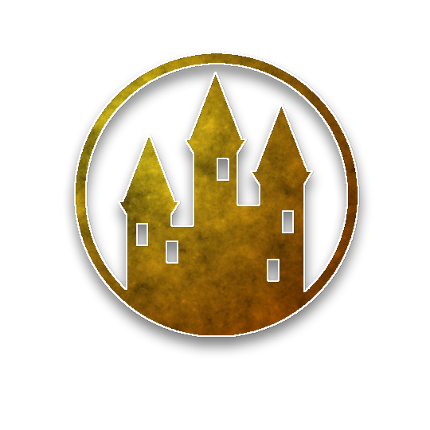 <a href="https://github.com/yoyosource/BOTC-HomeBrew/tree/master/Fabled/Igor">Igor</a>
-  <a href="https://github.com/yoyosource/BOTC-HomeBrew/tree/master/Fabled/Potion%20Instructions">Potion Instructions</a>

## Traveller
- 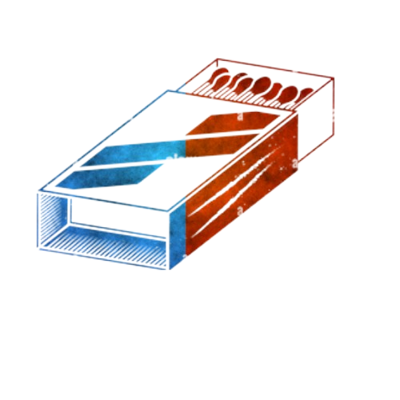 <a href="https://github.com/yoyosource/BOTC-HomeBrew/tree/master/Traveller/Arsonist">Arsonist</a>
- 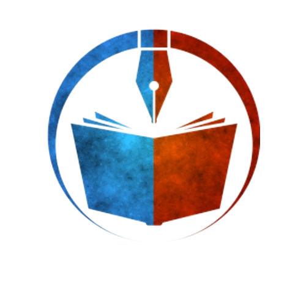 <a href="https://github.com/yoyosource/BOTC-HomeBrew/tree/master/Traveller/Author">Author</a>
- 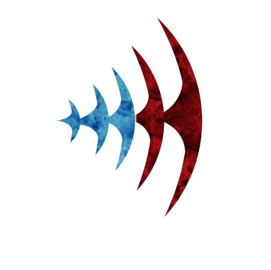 <a href="https://github.com/yoyosource/BOTC-HomeBrew/tree/master/Traveller/Echo">Echo</a>
-  <a href="https://github.com/yoyosource/BOTC-HomeBrew/tree/master/Traveller/Lost%20Soul">Lost Soul</a>
-  <a href="https://github.com/yoyosource/BOTC-HomeBrew/tree/master/Traveller/Snake%20Oil%20Seller">Snake Oil Seller</a>
- 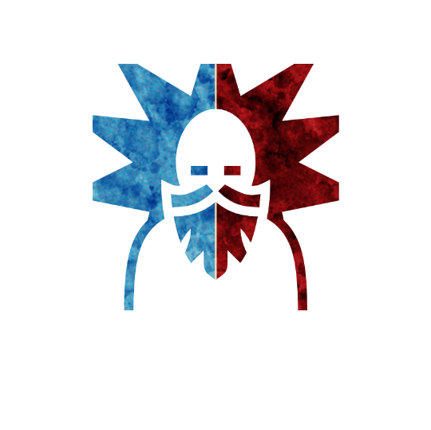 <a href="https://github.com/yoyosource/BOTC-HomeBrew/tree/master/Traveller/Socialist">Socialist</a>
- 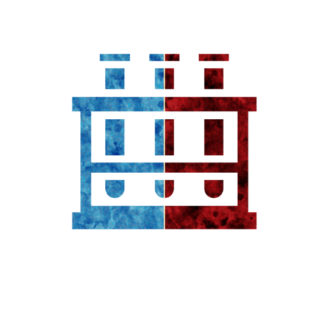 <a href="https://github.com/yoyosource/BOTC-HomeBrew/tree/master/Traveller/Toxicologist">Toxicologist</a>

## Potion

### Blue
-  <a href="https://github.com/yoyosource/BOTC-HomeBrew/tree/master/Potion/Blue/Potion%20of%20Conviction">Potion of Conviction</a>
-  <a href="https://github.com/yoyosource/BOTC-HomeBrew/tree/master/Potion/Blue/Potion%20of%20Curiosity">Potion of Curiosity</a>
-  <a href="https://github.com/yoyosource/BOTC-HomeBrew/tree/master/Potion/Blue/Potion%20of%20Empathy">Potion of Empathy</a>
-  <a href="https://github.com/yoyosource/BOTC-HomeBrew/tree/master/Potion/Blue/Potion%20of%20Generosity">Potion of Generosity</a>
-  <a href="https://github.com/yoyosource/BOTC-HomeBrew/tree/master/Potion/Blue/Potion%20of%20Hope">Potion of Hope</a>
-  <a href="https://github.com/yoyosource/BOTC-HomeBrew/tree/master/Potion/Blue/Potion%20of%20Joy">Potion of Joy</a>
-  <a href="https://github.com/yoyosource/BOTC-HomeBrew/tree/master/Potion/Blue/Potion%20of%20Love">Potion of Love</a>
-  <a href="https://github.com/yoyosource/BOTC-HomeBrew/tree/master/Potion/Blue/Potion%20of%20Resolution">Potion of Resolution</a>
-  <a href="https://github.com/yoyosource/BOTC-HomeBrew/tree/master/Potion/Blue/Potion%20of%20Self-Esteem">Potion of Self-Esteem</a>

### Red
-  <a href="https://github.com/yoyosource/BOTC-HomeBrew/tree/master/Potion/Red/Potion%20of%20Arrogance">Potion of Arrogance</a>
-  <a href="https://github.com/yoyosource/BOTC-HomeBrew/tree/master/Potion/Red/Potion%20of%20Disdain">Potion of Disdain</a>
-  <a href="https://github.com/yoyosource/BOTC-HomeBrew/tree/master/Potion/Red/Potion%20of%20Disillusionment">Potion of Disillusionment</a>
-  <a href="https://github.com/yoyosource/BOTC-HomeBrew/tree/master/Potion/Red/Potion%20of%20Envy">Potion of Envy</a>
-  <a href="https://github.com/yoyosource/BOTC-HomeBrew/tree/master/Potion/Red/Potion%20of%20Hatred">Potion of Hatred</a>
-  <a href="https://github.com/yoyosource/BOTC-HomeBrew/tree/master/Potion/Red/Potion%20of%20Obsession">Potion of Obsession</a>
-  <a href="https://github.com/yoyosource/BOTC-HomeBrew/tree/master/Potion/Red/Potion%20of%20Stress">Potion of Stress</a>
-  <a href="https://github.com/yoyosource/BOTC-HomeBrew/tree/master/Potion/Red/Potion%20of%20Terror">Potion of Terror</a>
